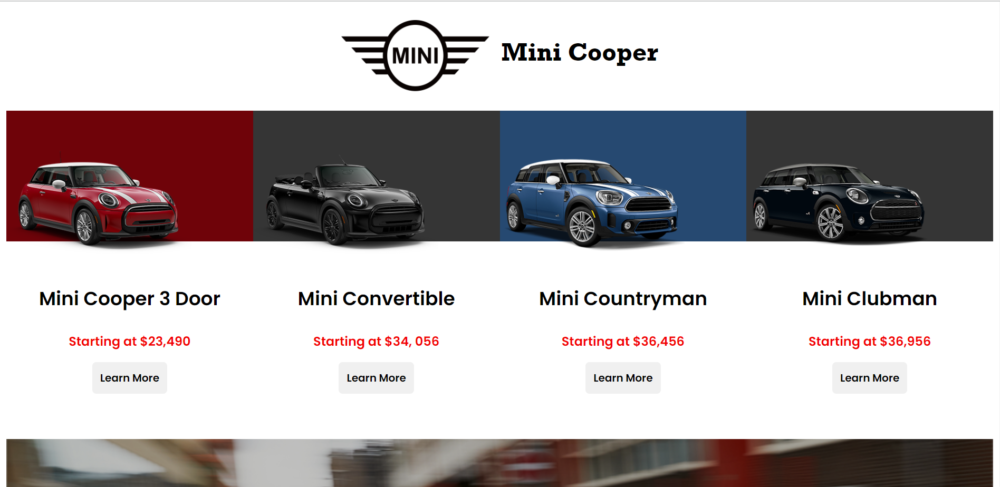
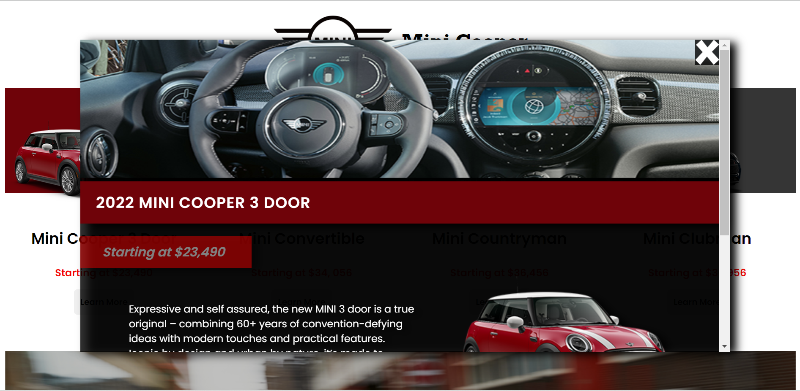
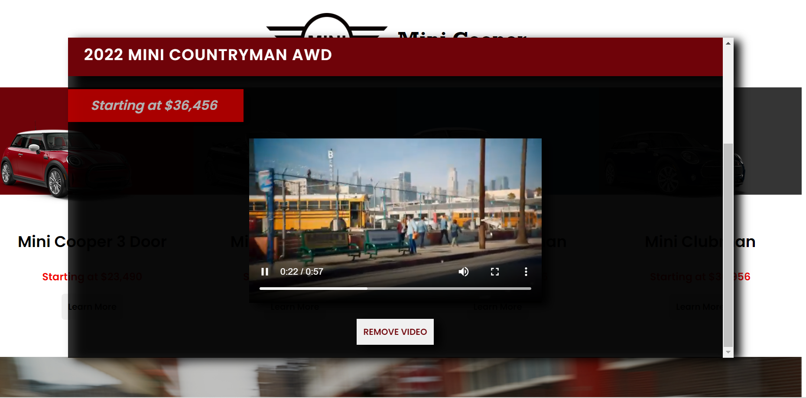
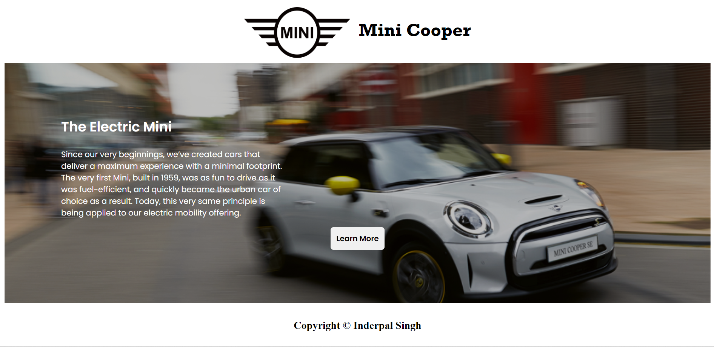

# Mini Cooper Application
This dynamic website is created using vue components and Fetch API. The goal of the app is to display data that changes based on what car the user selects. The app handles data changes of text, images and video!

# Tools Used
## HTML & CSS
## Javascript & Node JS
## SCSS
## Vue.js
## PHP
## SQL
## XAMPP
## Fetch Api

